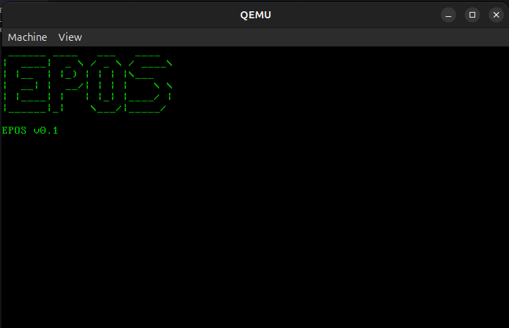

## EPOS — a lightweight 32-bit operating system built from scratch.

### Languages & Technology
* C
* x86 Assembly (NASM)
* Custom bare-metal linker script
* QEMU for emulation

### Acomplishments:
* Custom bootloader written in x86 Assembly
* GDT setup and switch to 32-bit protected mode
* Flat binary kernel linked with bootloader into a single `.bin` image
* Direct VGA text-mode output via segment `0xB8000`
* ASCII art logo rendered at boot
* Multisegment memory model (BSS, `.rodata`, `.data`)

## Build & Run
```bash
./run.sh
```
## Boot Screen

