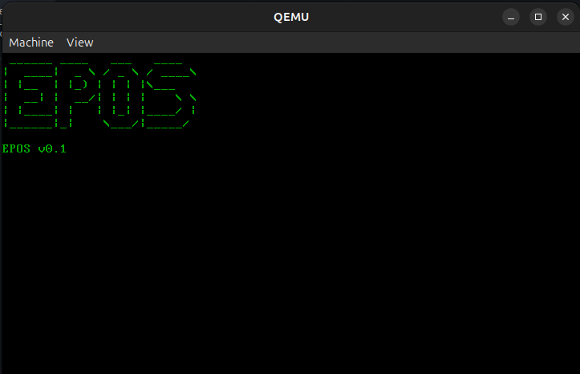

# EPOS — EP's Operating System

*A lightweight 32-bit operating system written from scratch in C and x86 Assembly, designed to boot and display a custom logo to VGA memory.*

---

## Overview

**EPOS** is a minimalist, bootable operating system built from the ground up as a low-level systems project. It demonstrates how operating systems work at the most fundamental level — from bootloading off the BIOS to direct memory manipulation.

This project was written **without an underlying OS**, **runtime**, or **standard library**, and was tested using `qemu` and raw assembly tools. All memory handling, text output, and program flow is managed explicitly via hardware-level interaction.

---

## Features
- **GDT (Global Descriptor Table)** and jumping to protected mode
- Linking C code to bootloader using a **bare-metal linker script**
- **32-bit protected mode execution**
- **Custom bootloader** written in x86 Assembly
- **Flat binary kernel** compiled with no runtime
- **Linked `.bin` image** combining bootloader and kernel
- **VGA text-mode output** by writing directly to segment `0xB8000`
- **ASCII art logo** rendered at boot
- **Multisegment memory model** setup (BSS, `.rodata`, `.data`)
- Designed for x86 emulation via **QEMU**

---

## 🔨 Architecture

The OS is split into two parts:
1. **Bootloader** (`boot.asm`) — loads the kernel into memory and jumps to it.
2. **Kernel** (`kernel.c`) — handles all logic for screen output and system display.

All text is rendered directly to VGA memory without libc. Since no BIOS interrupts are used post-boot, the kernel operates purely via memory access and bitwise operations.

---

## Build & Run

You can test **EPOS** in an emulator like QEMU.

### Prerequisites:
- `nasm` (Netwide Assembler)
- `gcc` or `clang` (for cross-compilation)
- `ld` (GNU linker)
- `qemu-system-i386` or similar

### Build & Run

```bash
./run.sh
```

### Demo Screenshot

